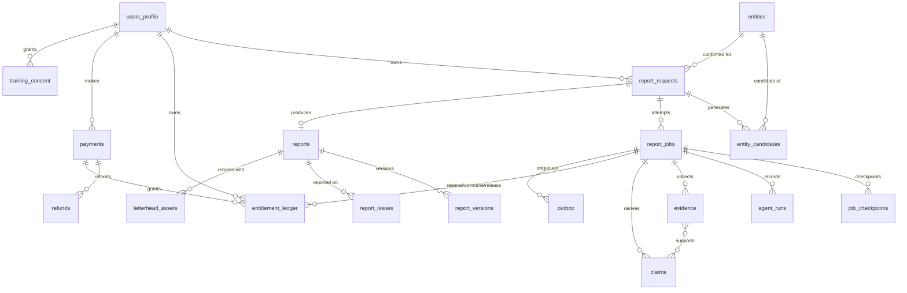

# ERD — Mandate Database Schema

**Status:** Specified
**Sources:** product-specification docs 09 (tables, state, entitlement transaction), 06 (evidence/claims), 10 (retention, RLS), 11 (ledger semantics)
**Related:** [API-SPEC.md](API-SPEC.md), [QUEUE-AND-JOB-SPEC.md](QUEUE-AND-JOB-SPEC.md)

Postgres 15 (Supabase). Conventions: `uuid` PKs (`gen_random_uuid()`), `timestamptz` for all times, `created_at`/`updated_at` on every table, snake_case, enums as Postgres `enum` types, JSON payloads validated against `packages/shared-schemas` before insert. Postgres is the source of truth; user-facing terminology remains **Mandate Brief** even where tables are named `reports*` (doc 16).

## 1. Entity-relationship diagram

## 2. Table specifications

### 2.1 `users_profile`

Extends `auth.users` (Supabase). **Never sent to models** (doc 10).

| Column | Type | Notes |
|---|---|---|
| `user_id` | uuid PK, FK → `auth.users.id` | |
| `full_name` | text | from first-login form |
| `country` | text | |
| `professional_role` | text | partner / associate / other |
| `phone_e164` | text null | set on trial verification |
| `phone_verified_at` | timestamptz null | AUTH-06 |
| `trial_status` | enum `trial_status` (`ineligible`,`eligible`,`claimed`,`blocked`) | |
| `trial_risk_flags` | jsonb | device/IP/disposable-email signals (AUTH-06) |
| `is_admin` | boolean default false | separate admin role (doc 10) |
| `terms_accepted_at`, `privacy_accepted_at` | timestamptz | |
| `deleted_at` | timestamptz null | AUTH-05 soft delete; tombstone retention |

### 2.2 `entities`

Confirmed/known legal entities (shared reference data, not user-owned).

| Column | Type | Notes |
|---|---|---|
| `id` | uuid PK | auditable entity key |
| `identity_key` | text unique | CIN-first dedupe key; normalised legal-name+state fallback **[implementation addition]** |
| `legal_name` | text not null | |
| `former_names` | text[] | renamed-company handling |
| `cin` | text null, unique when not null | exact identifier (ENTITY-05) |
| `company_type` | enum (`private`,`public_unlisted`,`listed`) | scope per charter §8 |
| `listed_status` | enum (`listed`,`unlisted`) | |
| `status` | text | active/inactive/etc. as sourced |
| `registered_office_state` | text | |
| `registered_office_summary` | text | |
| `jurisdiction` | text default `'IN'` | primary targets India-incorporated |
| `incorporation_date` | date null | |
| `primary_domain` | text null | |
| `brand_names` | text[] | brand never replaces legal identity (ENTITY-06) |

### 2.3 `entity_candidates`

| Column | Type | Notes |
|---|---|---|
| `id` | uuid PK | |
| `report_request_id` | uuid FK → report_requests | |
| `entity_id` | uuid FK → entities not null | every persisted candidate is linked to its normalised entity |
| `candidate_payload` | jsonb | full `EntityCandidate` schema (shared-schemas) |
| `confidence_score` | int | 0–100, doc 05 weights |
| `confidence_label` | enum (`strong_match`,`probable_match`,`ambiguous`,`insufficient_evidence`) | |
| `evidence_ids` | uuid[] | ENTITY-02 |
| `conflicts` | jsonb | negative factors |
| `score_audit` | jsonb | versioned factor decisions + concise rationale codes; no hidden reasoning **[implementation addition]** |
| `is_selected` | boolean default false | set on confirmation |
| `rank` | int | display order |

### 2.4 `report_requests`

One user intent to create one Mandate Brief. Owns the pre-generation state machine.

| Column | Type | Notes |
|---|---|---|
| `id` | uuid PK | |
| `user_id` | uuid FK → users_profile | RLS anchor |
| `input_kind` | enum (`website`,`legal_name`) | INTAKE-01 |
| `input_url` | text null | validated (INTAKE-03) |
| `input_legal_name` | text null | |
| `input_cin` | text null | INTAKE-05 |
| `confidential_ack_at` | timestamptz | mandatory checkbox (doc 03) |
| `idempotency_key` | text null | **[implementation addition]** unique per user when present; replays return the original draft |
| `confirmed_entity_id` | uuid FK → entities null | set by confirm-entity |
| `related_entity_ids` | uuid[] | ≤2, user-confirmed (ENTITY-07/08) |
| `client_role` | enum (`company_promoter`,`investor_acquirer`,`seller_transferor`,`other`) null | mandatory before generate (RESEARCH-04) |
| `transaction_category` | text null | optional overlay (RESEARCH-05) |
| `cross_border` | enum (`yes`,`no`,`unknown`) null | RESEARCH-06 |
| `clarifications` | jsonb | planner questions + reasons |
| `clarification_answers` | jsonb | |
| `sparse_data_disclosed_at` | timestamptz null | doc 03 errors: disclose before reservation |
| `state` | enum `request_state` — see §3 | |
| `active_job_id` | uuid null FK → report_jobs | one active generation per request (ADR-010) |

### 2.5 `report_jobs`

One generation attempt (regeneration = new request per EDIT-10; retries reuse the job with `attempt` bumps).

| Column | Type | Notes |
|---|---|---|
| `id` | uuid PK | |
| `report_request_id` | uuid FK | |
| `user_id` | uuid FK | denormalised for RLS |
| `attempt` | int default 1 | |
| `queue_msg_id` | bigint null | pgmq id |
| `trace_id` | text not null | NFR-04 |
| `budget_profile` | text default `'mvp-standard'` | |
| `prompt_bundle_version` | text | NFR-09 |
| `status` | enum `job_status` (`queued`,`leased`,`running`,`retry_wait`,`succeeded`,`failed_terminal`,`cancelled`) | |
| `current_stage` | text null | internal stage key |
| `leased_until` | timestamptz null | |
| `started_at`, `finished_at` | timestamptz null | |
| `failure_code`, `failure_detail` | text null | redacted, user-safe code + admin detail |
| `cost_total_inr` | numeric(10,4) default 0 | NFR-05 rollup |
| `quality_gate_result` | jsonb null | `QualityGate` schema |

### 2.6 `job_checkpoints`

| Column | Type | Notes |
|---|---|---|
| `id` | uuid PK | |
| `job_id` | uuid FK | |
| `stage` | text | internal stage key (QUEUE §6) |
| `payload` | jsonb | stage output (schema-validated) |
| `payload_hash` | text | sha256, integrity + idempotent stage completion |
| `completed_at` | timestamptz | |
| unique | | `(job_id, stage, attempt)` |

### 2.7 `evidence`

Doc 06 evidence object, stored separately from prose (RUN-04).

| Column | Type | Notes |
|---|---|---|
| `id` | uuid PK | |
| `job_id` | uuid FK | cost/audit link |
| `entity_id` | uuid FK null | |
| `url`, `canonical_url` | text | |
| `title`, `publisher` | text | |
| `source_tier` | smallint 1–5 | doc 06 hierarchy |
| `publication_date` | date null | |
| `accessed_at` | timestamptz | |
| `excerpt` | text | bounded length (licence care, doc 06) |
| `content_hash` | text | sha256 of fetched body |
| `entity_identifiers` | jsonb | legal names / CIN / addresses found |
| `jurisdiction_relevance` | text null | |
| `company_controlled` | boolean | |
| `extraction_method` | enum (`static_html`,`rendered`,`api`,`fixture`) | |
| `prompt_injection_suspected` | boolean default false | |
| `licence_notes` | text null | |
| `raw_body_storage_key` | text null | Storage ref; purged ≤30 days (retention R2) |
| `retention_class` | enum (`with_report`,`raw_30d`) | drives retention jobs |

### 2.8 `claims`

| Column | Type | Notes |
|---|---|---|
| `id` | uuid PK | |
| `job_id` | uuid FK | |
| `entity_id` | uuid FK | subject entity |
| `subject`, `predicate`, `object` | text | normalised triple |
| `display_text` | text | |
| `claim_type` | enum (`verified_fact`,`company_claim`,`third_party_report`,`inference`,`conflicted`,`not_publicly_available`) | doc 06 |
| `evidence_ids` | uuid[] | non-empty for material claims (gate) |
| `period` | text null | date/period the claim covers |
| `confidence` | enum (`high`,`medium`,`low`) | |
| `freshness` | enum (`current`,`recent`,`dated`,`stale`) | REPORT-08 |
| `contradiction_group` | uuid null | groups conflicting claims |
| `verifier_status` | enum (`pending`,`approved`,`rejected`,`conflicted`) | composer uses `approved` only |
| `report_sections` | text[] | brief sections the claim supports |
| `model_prompt_version` | text | NFR-09 |
| `is_material` | boolean | drives provenance gate |

### 2.9 `agent_runs`

| Column | Type | Notes |
|---|---|---|
| `id` | uuid PK | |
| `job_id` | uuid FK | |
| `agent_type` | text | stage/agent key |
| `model_id`, `provider` | text | as returned by gateway |
| `prompt_version` | text | |
| `input_tokens`, `output_tokens` | int | |
| `cost_inr` | numeric(10,6) | NFR-05 |
| `latency_ms` | int | |
| `zdr_enforced` | boolean not null | must be true; logged proof (doc 10) |
| `result` | enum (`ok`,`schema_retry_ok`,`error`,`refused`) | |
| `error_detail` | text null | redacted |

### 2.10 `reports`

| Column | Type | Notes |
|---|---|---|
| `id` | uuid PK | |
| `report_request_id` | uuid FK unique | one report per successful request |
| `user_id` | uuid FK | RLS anchor |
| `job_id` | uuid FK | the successful job |
| `system_version_id` | uuid FK → report_versions | immutable draft (EDIT-02) |
| `current_version_id` | uuid FK → report_versions | |
| `main_page_count` | smallint | 1–4 (REPORT-02) |
| `research_current_to` | timestamptz | freshness statement (doc 06) |
| `status` | enum (`ready`,`deleted`) | HISTORY-02, tombstone on delete |
| `deleted_at` | timestamptz null | |

### 2.11 `report_versions`

| Column | Type | Notes |
|---|---|---|
| `id` | uuid PK | |
| `report_id` | uuid FK | |
| `parent_version_id` | uuid FK null | version 0 (system) has null |
| `version_number` | int | 0 = system draft |
| `created_by` | enum (`system`,`user`,`admin_correction`) | ISSUE-04 corrections |
| `document_json` | jsonb | `BriefDocument` schema (ADR-007) |
| `document_hash` | text | reproducibility |
| `rendered_pdf_key` | text null | Storage key, signed access only |
| `render_options` | jsonb null | annex toggle, letterhead applied flag (never the asset) |
| unique | | `(report_id, version_number)`; trigger forbids UPDATE on rows where `created_by='system'` |

### 2.12 `letterhead_assets`

| Column | Type | Notes |
|---|---|---|
| `id` | uuid PK | |
| `user_id`, `report_id` | uuid FK | |
| `storage_key` | text | encrypted bucket (doc 10) |
| `file_type` | enum (`pdf`,`png`,`jpg`) | EDIT-06 |
| `scan_status` | enum (`pending`,`clean`,`rejected`) | malware/active-content scan |
| `expires_at` | timestamptz not null | ≤24 h (EDIT-09); purge job |
| `deleted_at` | timestamptz null | |

### 2.13 `entitlement_ledger`

Append-only (ADR-010). No UPDATE/DELETE grants to any role; enforced also by trigger.

| Column | Type | Notes |
|---|---|---|
| `id` | uuid PK | |
| `user_id` | uuid FK | |
| `event_type` | enum (`purchase_grant`,`trial_grant`,`reserve`,`consume`,`release`,`restore`,`expiry`,`refund_reversal`) | doc 09 |
| `quantity` | int | +grants / −reserve etc.; sign fixed per type by CHECK |
| `payment_id` | uuid FK null | for grants/reversals |
| `job_id` | uuid FK null | for reserve/consume/release/restore |
| `reserve_event_id` | uuid FK null → self | consume/release/restore reference their reserve |
| `idempotency_key` | text unique | e.g. `reserve:{job_id}`, `webhook:{razorpay_event_id}` |
| `expires_at` | timestamptz null | on grants (AS-13: 90/120-day validity) |
| `reason` | text null | admin restorations (ISSUE-03) |
| `created_by` | enum (`system`,`webhook`,`admin`) | |

### 2.14 `payments` and `refunds`

`payments`: `id`, `user_id`, `razorpay_order_id` (unique), `razorpay_payment_id` (unique null), `package_code` (`single`,`pack5`,`pack10`,`trial`), `amount_inr`, `currency`, `status` (`created`,`authorized`,`captured`,`failed`), `webhook_verified_at`, `raw_gateway_ids` immutable. No card data stored (doc 11).

`refunds`: `id`, `payment_id` FK, `razorpay_refund_id` unique, `amount_inr`, `status`, `reason` (`undeliverable_service`,`quality`,`admin_discretion`,`abuse_rejected`), `initiated_by` (`auto`,`admin`,`user_one_click`).

### 2.15 `report_issues`

`id`, `report_id` FK, `report_version_id` FK (ISSUE-02 pins version), `user_id`, `category` enum (`wrong_entity`,`inaccurate_fact`,`weak_source`,`outdated`,`omission`,`formatting`,`other`), `description`, `highlighted_text` jsonb null, `evidence_refs` uuid[], `status` (`open`,`investigating`,`resolved`,`rejected`), `root_cause` text null (ISSUE-03 taxonomy from doc 12), `resolution` enum null (`corrected`,`restored`,`refunded`,`rejected`), `entitlement_action_ledger_id` uuid null.

### 2.16 `training_consent`

`id`, `user_id`, `consent_version`, `granted_at`, `withdrawn_at` null, `scope` jsonb. Opt-in only; withdrawal stops future training use (doc 10/12).

### 2.17 Implementation-addition tables **[implementation addition]**

| Table | Purpose |
|---|---|
| `outbox` | transactional enqueue: `id`, `topic`, identifier-only `payload` jsonb, unique `idempotency_key`, `created_at`, `dispatched_at` null, `dispatch_attempts`, stable `last_error_code`; drained by relay (QUEUE §4) |
| `webhook_events` | raw verified Razorpay events: `razorpay_event_id` unique, `type`, `payload`, `processed_at`, `signature_valid` — replay-safe (PAY-09) |
| `admin_audit_log` | admin actions (restore, refund, block, correction publish): actor, action, subject ids, reason — auditability (PAY-10, ISSUE-03) |
| `notification_log` | completion/failure emails: `user_id`, `job_id`, `kind`, `sent_at`, `provider_message_id`, idempotency key `email:{job_id}:{kind}` (RUN-10) |
| `provider_cost_events` | per external call: `job_id`, `provider`, `unit`, `qty`, `cost_inr` — every external cost attributable to a report (NFR-05) |

## 3. `request_state` enum (mirrors doc 09 state machine)

`draft`, `resolving_entity`, `awaiting_entity_confirmation`, `preliminary_research`, `awaiting_clarification`, `queued`, `researching`, `verifying`, `composing`, `rendering`, `completed`, `failed_no_charge`, `retry_wait`, `failed_restored`, `cancelled_restored`.

Transition rules, ownership (web vs worker) and side effects are specified in [QUEUE-AND-JOB-SPEC.md §5](QUEUE-AND-JOB-SPEC.md). The `report_requests.state` column is the single user-visible status source; dashboard labels map per QUEUE §7.

## 4. Row-level security (NFR-02, doc 10)

RLS enabled on **every** table; default deny. Policy families:

| Tables | Policy |
|---|---|
| `users_profile`, `report_requests`, `reports`, `report_versions`, `report_issues`, `letterhead_assets`, `entitlement_ledger` (SELECT), `payments`/`refunds` (SELECT), `training_consent`, `notification_log` (SELECT) | `user_id = auth.uid()`; ledger/payments are SELECT-only for users (writes via service role paths) |
| `entity_candidates` | via join: request owner only |
| `entities` | SELECT for authenticated users (shared reference data); writes service-role only |
| `report_jobs`, `job_checkpoints`, `evidence`, `claims`, `agent_runs`, `outbox`, `webhook_events`, `provider_cost_events` | no user policies (service-role only); user-visible projections exposed through API views (`job_progress_view`) filtered by ownership |
| Admin access | `is_admin()` helper on dedicated admin policies; all admin mutations also write `admin_audit_log` |

Additional rules: the worker uses a dedicated Postgres role (not the anon/service web key) with least-privilege grants; storage buckets use per-user/report key prefixes and signed, short-lived URLs; possession of a report id alone never authorises access (doc 10).

Phase 1 exposes intake creation only through the authenticated
`create_report_request` RPC; authenticated clients retain no direct table-insert
grant. The security-definer function has an empty search path, derives ownership
only from `auth.uid()`, serialises creates per user, replays an existing
idempotency key before rate-limit evaluation and atomically enforces the API
limit of ten successful intake requests per rolling hour. It does not reference
an entitlement table or queue.

Entity resolution is likewise mutation-RPC-only. `enqueue_entity_resolution` derives
ownership from `auth.uid()`, locks per user/request, applies replay before the 10/hour
limit and atomically changes `draft → resolving_entity` with an identifier-only outbox
row. Worker-only completion/failure functions persist normalised entities, ranked
candidates and factor audits before changing state. A trigger rejects every state edge
outside the authoritative state machine even for direct service-role updates.

## 5. Entitlement-ledger invariants

Enforced by constraints + serializable reserve transaction + nightly reconciliation job (flags, never auto-fixes):

1. **Append-only:** no UPDATE/DELETE on `entitlement_ledger` (revoked + trigger).
2. **Sign discipline:** `purchase_grant`/`trial_grant`/`release`/`restore` positive; `reserve`/`consume`/`expiry`/`refund_reversal` negative (CHECK per event type).
3. **Non-negative balance:** `available(user) ≥ 0` verified inside the serializable reserve transaction (ADR-010).
4. **Reserve exclusivity:** at most one active (un-consumed, un-released) reserve per `report_request` — partial unique index on active reserves per request.
5. **Reserve lineage:** every `consume`/`release`/`restore` references exactly one `reserve` event; at most one terminal outcome per reserve (unique on `reserve_event_id` for terminal types).
6. **Idempotency:** `idempotency_key` unique; retried webhooks/stage completions insert nothing new.
7. **Consume only on quality pass:** `consume` insert requires `report_jobs.quality_gate_result->>'passed' = 'true'` (application invariant + reconciliation check; PAY-05).
8. **Trial once:** at most one `trial_grant` per user, phone, device cluster (partial unique + risk checks; AUTH-06).
9. **Expiry respects validity:** reserve rejects grants past `expires_at`; expiry events generated by scheduled job only.

## 6. Retention columns → policy map (doc 10)

| Data | Table/column | Default | Mechanism |
|---|---|---|---|
| Account + ledger | `users_profile`, `entitlement_ledger` | account life + legally required period | soft delete + tombstone |
| Mandate Briefs/versions | `reports`, `report_versions` | until user deletes | user DELETE endpoint |
| Raw fetched page bodies | `evidence.raw_body_storage_key` | ≤30 days | nightly purge job |
| Evidence metadata/excerpts | `evidence` | while Mandate Brief exists | cascade on report delete (tombstone kept) |
| Provider/model logs | `agent_runs`, `provider_cost_events` | 90 days | scheduled prune (cost rollups retained on `report_jobs`) |
| Security audit logs | `admin_audit_log` | 180 days, subject to review | scheduled prune |
| Failed-job diagnostics | `job_checkpoints`/`failure_detail` of failed jobs | 30 days | scheduled prune |
| Letterhead | `letterhead_assets` | after render or ≤24 h | `expires_at` purge job |
| Deleted-report tombstone | `reports` row with `status='deleted'` | minimum billing/security record | retained |

Retention jobs are specified in [SECURITY-THREAT-MODEL.md §8](SECURITY-THREAT-MODEL.md) and scheduled in [DEPLOYMENT-SPEC.md §7](DEPLOYMENT-SPEC.md).

## 7. Key indexes

`report_requests(user_id, created_at desc)`; `report_jobs(status, leased_until)` for lease sweeps; `job_checkpoints(job_id, stage)`; `evidence(job_id)`, `evidence(content_hash)` dedupe; `claims(job_id, verifier_status)`, `claims(contradiction_group)`; `entitlement_ledger(user_id, created_at)`, unique `idempotency_key`; `outbox(dispatched_at) where dispatched_at is null`; `webhook_events(razorpay_event_id)` unique; `letterhead_assets(expires_at) where deleted_at is null`.
