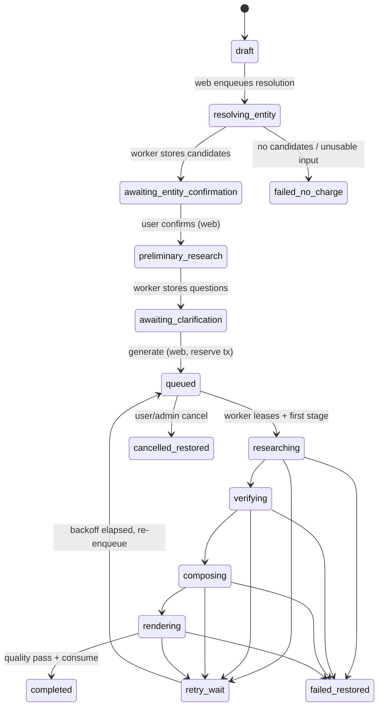

# QUEUE-AND-JOB-SPEC — Queueing, Job State and Recovery

**Status:** Specified
**Sources:** product-specification docs 08 (job lifecycle), 09 (state machine, message, transaction, idempotency), 04 (budgets), 03 (progress stages)
**Related:** [ERD.md](ERD.md), [AGENT-PROMPT-SPEC.md](AGENT-PROMPT-SPEC.md), [API-SPEC.md](API-SPEC.md)

## 1. Topology

Supabase Queues (pgmq) via `QueueAdapter` (ADR-002). Queues:

| Queue | Producer | Consumer | Payload |
|---|---|---|---|
| `mandate_jobs` | outbox relay | worker job loop | `JobMessage` (§3) — full Mandate Brief generation |
| `mandate_light_tasks` | outbox relay | worker light loop | entity resolution, preliminary research, PDF re-render — unpaid/short tasks kept off the heavy queue |
| `mandate_jobs_dlq` | worker | admin tooling | poison messages after max delivery |

Worker concurrency: 2 heavy jobs global (AS-05) + 2 light tasks. Adding workers means running more containers pointed at the same queues; job state lives entirely in Postgres, so no redesign is needed (NFR-10).

## 2. Delivery semantics

pgmq gives at-least-once delivery with visibility timeouts. Exactly-once *effects* are the consumer's job:

- every stage completion is recorded in `job_checkpoints` keyed `(job_id, stage, attempt)` — re-delivery skips completed stages;
- every ledger write carries an idempotency key (ERD §5);
- PDF render, email send and webhook processing are idempotent by key (`render:{version_id}:{options_hash}`, `email:{job_id}:{kind}`, `webhook:{event_id}`) per doc 09's idempotency list.

## 3. Message schema

Doc 09 verbatim; validated against shared-schemas before send and after receive:

```json
{
  "schemaVersion": 1,
  "jobId": "uuid",
  "reportRequestId": "uuid",
  "userId": "uuid",
  "confirmedEntityId": "uuid",
  "attempt": 1,
  "traceId": "trace-id",
  "budgetProfile": "mvp-standard"
}
```

Rules: messages carry identifiers only — never payment, profile or letterhead data (doc 09). Unknown `schemaVersion` → dead-letter with alert. `attempt` is informational; the DB row is authoritative.

Light tasks use a separate generated `LightTaskMessage` **[implementation addition]**
because pre-confirmation resolution cannot truthfully supply `jobId` or
`confirmedEntityId` from the paid `JobMessage`:

```json
{
  "schemaVersion": 1,
  "taskId": "uuid",
  "taskType": "resolve_entity|preliminary_research|render_pdf",
  "reportRequestId": "uuid",
  "userId": "uuid",
  "attempt": 1,
  "traceId": "trace-id"
}
```

The same identifier-only/unknown-version rules apply. The outbox row id equals
`taskId`; the database validates the exact key allowlist, and task effects are
idempotent against authoritative request state.

## 4. Enqueue: the reserve+enqueue transaction and outbox

`POST /api/report-requests/{id}/generate` runs one **serializable** transaction (doc 09, ADR-010):

1. `SELECT … FOR UPDATE` the user's balance row (materialised ledger view backing table).
2. Reject if `available < 1` → 409 `NO_ENTITLEMENT` (nothing written).
3. Reject if the request already has an active job (`report_requests.active_job_id` guard) → 409 `GENERATION_IN_PROGRESS`.
4. Insert `entitlement_ledger` `reserve` event (`idempotency_key = reserve:{job_id}`).
5. Insert `report_jobs` row (`status = queued`, new `trace_id`).
6. Insert `outbox` row with the `JobMessage`.
7. Set `report_requests.state = queued`, `active_job_id`.
8. Commit.

The **outbox relay** (worker-side loop, every 2 s) sends undispatched outbox rows to pgmq and marks `dispatched_at`. Crash between commit and dispatch loses nothing; relay retries. Duplicate dispatch is harmless (§2). Light tasks (resolution, preliminary research, re-render) use the same outbox without any ledger steps.

## 5. State machine (authoritative)

`report_requests.state`, exactly as doc 09; ownership annotated:



Transition rules:

- **Web-owned** transitions happen in API handlers under RLS; **worker-owned** transitions happen via the worker DB role. Both go through a single `transition(request_id, from, to, side_effects)` helper that rejects illegal moves (409/log) — the enum in ERD §3 is the single source of truth.
- `failed_no_charge`: only reachable before reservation (resolution/preliminary failures). No ledger events exist (doc 05 failure rules, PAY "before confirmation: no reservation").
- `failed_restored`: terminal generation failure. Side effects, atomically: ledger `release` (single purchase → also offer one-click refund per doc 11) or `restore` (pack), `report_jobs.status = failed_terminal`, failure email, archive message (RUN-09, PAY-06/07/08).
- `completed`: side effects, atomically: ledger `consume` (requires `quality_gate_result.passed`, PAY-05), `reports` + `report_versions` v0 insert, success email, archive message.
- `cancelled_restored`: release + archive; allowed from `queued` always, from running stages only at stage boundaries (worker checks a cancellation flag between stages).

## 6. Worker job loop, stages and checkpoints

```
loop:
  msg = queue.lease(mandate_jobs, visibility=120s)
  job = load_and_validate(msg)                  # status/lease guards
  for stage in PIPELINE:                        # ordered stage list below
      if checkpoint_exists(job, stage): continue    # resume support
      extend_lease_heartbeat(every 60s)
      out = stage.run(job, budgets.slice(stage))    # typed, bounded
      write_checkpoint(job, stage, out)             # + request.state sync
  finalize(job)                                  # consume/complete or fail
  queue.archive(msg)
```

Internal pipeline stages (details in AGENT-PROMPT-SPEC):

| # | Stage key | Maps to request state |
|---|---|---|
| 1 | `plan` | researching |
| 2 | `research_business` | researching |
| 3 | `research_industry` | researching |
| 4 | `research_competitors` | researching |
| 5 | `research_corporate` | researching |
| 6 | `research_regulatory` | researching |
| 7 | `research_public_risk` | researching |
| 8 | `verify_contradictions` | verifying |
| 9 | `analyze_transaction_prep` | verifying |
| 10 | `compose_brief` | composing |
| 11 | `final_verify` | composing |
| 12 | `render_pdf` | rendering |
| 13 | `deliver` (persist report, consume, email) | completed |

Checkpoint payloads are the stage's validated output (research bundles, verified claim sets, `BriefDocument`, render manifest). A worker restart re-leases the message, finds completed checkpoints and **resumes at the first missing stage** (doc 08: "worker restart must permit checkpointed resume") — acceptance test E2E-05/AT-NFR-01.

## 7. Truthful progress mapping (RUN-02, doc 03)

| User-visible stage (verbatim, doc 03) | Internal stages |
|---|---|
| 1. Confirming research scope | `plan` |
| 2. Gathering company information | `research_business`, `research_corporate` |
| 3. Reviewing business and industry | `research_industry`, `research_competitors` |
| 4. Reviewing regulatory and public-risk signals | `research_regulatory`, `research_public_risk` |
| 5. Verifying sources and inconsistencies | `verify_contradictions`, `analyze_transaction_prep` |
| 6. Preparing the Mandate Brief | `compose_brief`, `final_verify` |
| 7. Creating the editable version | `render_pdf`, `deliver` |

A user stage is shown "done" only when all its internal stages have checkpoints. No percentages, no synthetic animation tied to time (ADR-012).

## 8. Budgets (`mvp-standard` profile)

Loaded from versioned config; initial values from AGENT-OUTPUT-SCHEMAS plus token/cost caps (AS-06):

| Budget | Cap | Enforced by |
|---|---|---|
| Searches | 45 / job | SearchProvider wrapper counter |
| Pages fetched | 100 / job | SafeFetcher counter |
| Browser (Playwright) time | 180 s / job | fetch pool |
| Frontier-model calls | 4 / job | ModelGateway |
| Total model tokens | 350k in / 60k out per job | ModelGateway |
| Model+provider cost | ₹120 / job hard cap **[implementation addition, recalibrated after 30 measured briefs]** | ModelGateway + provider_cost_events |
| Wall-clock runtime | 1,200 s / job | job loop deadline |
| Stage retries | 2 per stage | stage runner |
| Job re-deliveries | 3, then DLQ | queue adapter |
| Concurrent heavy jobs | 2 global | lease policy |

Budget exhaustion mid-stage follows doc 04 stopping rules: if mandatory fields are supported → proceed with gaps converted to kickoff questions; if mandatory coverage is impossible → `retry_wait` (transient causes) or `failed_restored` (hard causes). A gap becomes a question, never unlimited search.

## 9. Retry and failure policy

| Failure class | Examples | Treatment |
|---|---|---|
| Transient provider | 429/5xx, `NoApprovedCapacity`, timeouts | stage retry ×2 with jittered backoff (30 s, 120 s); then `retry_wait` with job backoff 5 min → 30 min → 2 h; max 3 re-deliveries |
| Deterministic stage failure | schema validation fails twice, quality gate hard-fails on re-compose | `failed_restored` immediately (retrying identical inputs is waste) |
| Poison message | invalid schema, missing rows | DLQ + admin alert; no ledger effects (reserve released by the sweep, below) |
| Worker crash | OOM, host reboot | lease expires → re-delivery → checkpoint resume |
| PDF-only failure | render error post-compose | re-render from stored `BriefDocument`; never rerun research (doc 03) |

**Reservation sweep** [implementation addition]: a scheduled task flags jobs whose reservation is older than 24 h without terminal outcome, releases orphaned reserves and alerts — reservations must not leak (doc 11 failure treatment).

## 10. Notifications

`deliver` / failure finalizer writes `notification_log` and sends via `EmailProvider` (RUN-10): success → "Your Mandate Brief is ready" with dashboard link (no report content in email); failure → cause-free apology + "your entitlement has been restored" + support contact. Send is idempotent by `email:{job_id}:{kind}`.

## 11. Admin controls

Admin can (API §8): inspect stage checkpoints and failures, retry from last checkpoint, cancel with release, inspect DLQ, replay outbox rows, and view reconciliation between ledger events and job outcomes. All mutations audit-logged.
