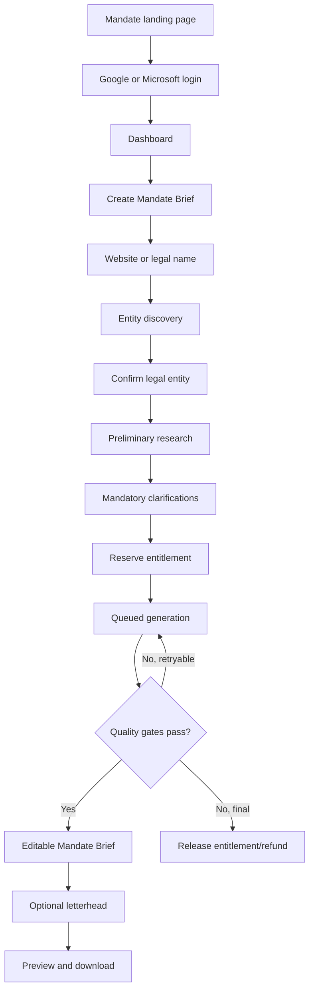

# 03 — User Journey and Screen Specification

## Primary flow

## Landing page

Must include:

- Mandate name and “Know the company before the first call” positioning;
- clear transaction-preparation promise;
- public-information-only explanation;
- sample Mandate Brief preview;
- three-step flow;
- pricing;
- login buttons;
- statement that it is not legal advice or due diligence.

Avoid agent diagrams, token language and claims of complete legal coverage.

## Authentication

- Continue with Google.
- Continue with Microsoft.
- On first login: name, country, role, phone verification for trial, terms/privacy.
- Firm name is not required.

## Dashboard

Show:

- Create Mandate Brief;
- available/reserved entitlements;
- recent Mandate Briefs;
- active jobs;
- payment history;
- account deletion.

Statuses:

- Entity confirmation required
- Clarification required
- Queued
- Researching
- Verifying
- Drafting
- Preparing Mandate Brief
- Ready
- Failed — entitlement restored
- Deleted

## New Mandate Brief

### Website tab

> We will identify the legal entity behind this website and ask you to confirm it before research continues.

### Legal name tab

Legal name field; optional CIN.

> A CIN helps distinguish companies with similar names and obtain exact master information from compatible sources.

Mandatory checkbox:

> I confirm that I am not submitting confidential information.

## Entity confirmation

Candidate cards show legal name, CIN, status, registered office/state, domain relationship, evidence snippets and confidence label: Strong, Probable, Ambiguous or Insufficient.

Actions:

- This is the company
- None of these
- Enter legal name
- Add CIN
- Clarify multiple entities

No entitlement is reserved.

## Clarification

After preliminary research:

**Mandatory:** Who are you preparing for?

- Company/promoters
- Investor/acquirer
- Seller/transferor
- Other/unclear

Optional unless material:

- broad transaction category;
- foreign investment/counterparty;
- known public issue to emphasise.

Each mandatory question explains why it matters.

## Generation progress

Show stages only:

1. Confirming research scope
2. Gathering company information
3. Reviewing business and industry
4. Reviewing regulatory and public-risk signals
5. Verifying sources and inconsistencies
6. Preparing the Mandate Brief
7. Creating the editable version

Do not expose chain-of-thought or fabricated percentages.

## Mandate Brief editor

- Main paginated editor.
- Source/confidence panel.
- Version selector.
- Save, regenerate, issue report, letterhead, download.
- System draft immutable.
- User-added unsupported facts receive an editor-only warning.
- Regeneration is a new paid Mandate Brief.

## Letterhead

Accept one-page PDF, PNG or JPG. Allow background/header, scale, margins and continuation-page preview.

> Your letterhead is used only for document rendering and is not sent to an AI model.

Default deletion after render or within 24 hours.

## Download

Show final preview, version, entity/CIN, research date, source-annex option, disclaimer and PDF download. No public sharing link.

## Report an issue

Categories attach to the exact version and may include highlighted text. The original remains available. A correction creates a new version.

## Role-specific emphasis

### Company/promoter side

Business story, responsible people, operating structure, investors/governance, cap table, approvals, licences, locations, employees, assets, transaction objectives and record readiness.

### Investor/acquirer side

Diligence perimeter, business model, employees, establishments/factories, premises, assets/IP, licences, FEMA/FDI, contracts, litigation, security interests, data/privacy, environment and labour.

The evidence collection remains broad for both roles.

## Errors

- No entity: ask legal name/CIN, no charge.
- Sparse public data: disclose likely shorter Mandate Brief before reservation.
- Conflicting information: clarify or mark conflict.
- Provider outage: retry/queue; terminal failure restores entitlement.
- PDF failure: rerender from stored version, do not rerun research.
