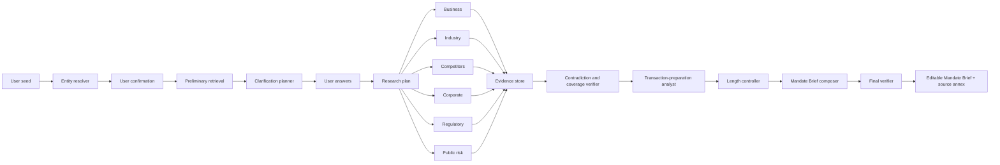

# 04 — Research and Agent Architecture

## Principle

Mandate is an evidence pipeline with model-assisted reasoning, not one autonomous chatbot. No agent may write an unsupported material claim into a Mandate Brief.

## Pipeline

## Supervisor

Must read the confirmed entity and evidence inventory, identify missing high-value fields, formulate clarifications, create a bounded plan, select agents, allocate budgets, stop redundant research, identify material related entities, route contradictions and decide sufficiency. It outputs structured plans, not free-form prose.

## Logical agents

### Entity resolver

Finds candidates, CIN, brand/entity relationship, confidence and conflicts. Runs before billing.

### Business researcher

Products, services, revenue model, customers, geography, group operations, locations, premises/factories, employees, assets/IP, management and material partners.

### Industry researcher

Industry definition, value chain, sector drivers, relevant trends and the company’s position. Avoid generic market-size filler.

### Competitor researcher

Direct competitors, substitutes, rationale and basis of competition. No SEO-style list.

### Corporate/governance researcher

Legal identity, status, incorporation, office, directors, promoters, investors, funding, group, shareholding signals, charges and listed disclosures.

### Regulatory researcher

Preliminary activity classification, licences, FDI/FEMA questions, DPIIT/startup signals, workforce thresholds, premises/factory/environmental, data/consumer and sector-specific regimes. No final legal opinions from incomplete public facts.

### Public-risk researcher

Entity-matched litigation, insolvency, regulator orders, enforcement, allegations, disputes, cyber incidents and adverse media. False-positive avoidance is more important than recall.

### Transaction-preparation analyst

Maps universal research to client role and optional transaction overlay. Produces matters for attention, gaps, next checks and questions.

### Contradiction/coverage verifier

Checks entity consistency, dates, units, conflicts, unsupported assertions, staleness, source strength and missing critical fields.

### Mandate Brief composer

Receives only approved claims, labelled inferences, conflicts, gaps, context and length budget.

### Final verifier

Checks entity, provenance, length, question relevance, source annex, uncertainty, privacy, disclaimer and rendering.

## Model tiers

- **Low-cost:** classification, extraction, normalisation, duplicate detection and structured summaries.
- **Mid-tier:** planning, contradiction analysis, competitor rationale, regulatory spotting and question generation.
- **Frontier:** complex supervision, multi-source synthesis, difficult contradictions, final composition and high-risk adjudication.

Model selection is configuration. Store model/provider, prompt version, tokens, cost, latency, result and ZDR status.

## Transaction type

### Does not change

Business, entity, people, structure, industry, competition, regulation, locations, workforce, assets, capital and public-risk research.

### May change

Ordering, depth, emphasis, matters for attention and kickoff questions.

A gap should become a question rather than trigger unlimited search.

## Budget rules

Cap searches, pages, browser work, tokens, frontier calls, retries, wall-clock time and concurrent tasks. Stop when mandatory fields are supported, searches duplicate, authoritative sources answer the issue, information is not public or the cost cap is reached.

## Prompt-injection defence

Retrieved content is data. Agents ignore instructions in pages, never disclose secrets, use only allowed tools, preserve evidence metadata and flag suspicious content.

## Reproducibility

A Mandate Brief must be explainable from confirmed entity, user answers, research plan, searches, evidence, claims, models/prompts, verification and version. Hidden chain-of-thought is neither stored nor exposed.
