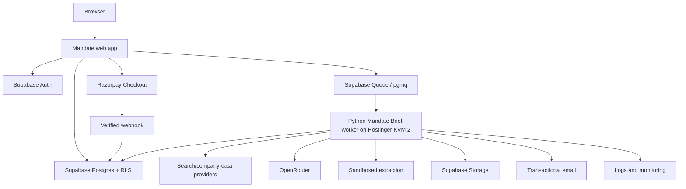

# 08 — Technical Architecture

## Recommended MVP

## Web

Use Next.js + TypeScript, short request/response APIs, a structured Mandate Brief editor and portable deployment. No long AI workflow belongs inside a browser or serverless request.

## Supabase

Use Google/Microsoft auth, Postgres, RLS, Storage and durable Postgres-native Queue/`pgmq`. The database is the source of truth.

## Queue

Supabase Queues is the recommended MVP. It provides durable delivery and retries with fewer moving parts than Redis. Keep a queue abstraction for later SQS migration.

## Worker

Containerised Python 3.12+ service with FastAPI health/admin, Pydantic, async HTTP, bounded Playwright, Trafilatura/BeautifulSoup extraction, explicit orchestration or LangGraph, and HTML/CSS-to-PDF rendering.

n8n may support alerts/manual workflows but not the critical Mandate Brief path.

## Provider interfaces

`SearchProvider`, `PageFetcher`, `CompanyDataProvider`, `RegulatorySourceAdapter`, `LitigationSourceAdapter`, `ModelRouter`, `QueueAdapter` and `StorageAdapter`.

## Model gateway

Enforce task-to-model policy, ZDR, provider allowlist, token/cost caps, retries/fallbacks, structured-output validation, usage logging and exclusion of user/firm identity.

## Storage

Supabase Storage for PDFs, source annexes, limited evidence snapshots and short-lived letterheads, using user/report-scoped keys and signed links.

## Hostinger KVM 2 role

Use for two low-concurrency jobs initially, limited Playwright, PDF rendering, health endpoint and optional monitoring/reverse proxy. Do not use for frontier inference, unlimited browsers, sole critical-data storage or synchronous public requests.

Suggested Docker Compose: worker, renderer, health API, Caddy/Nginx and optional Uptime Kuma. Use SSH keys, non-root deployment, firewall, updates, resource limits, secrets outside images, health checks and snapshots.

## Job lifecycle

1. Validate confirmed entity and entitlement.
2. Atomically reserve and enqueue.
3. Worker leases message.
4. Create bounded research plan.
5. Checkpoint each stage.
6. Verify.
7. Consume entitlement only after quality pass.
8. Store Mandate Brief.
9. Email user.
10. Archive message.

Worker restart must permit checkpointed resume.

## Cost control

Track and cap model spend, search, company data, pages, browser time, retries and runtime. Cost optimisation may not weaken entity or provenance standards.

## Prototype budget

Approximately ₹1,000/month incremental is feasible only for low-volume testing with existing Hostinger and free/low-cost provider tiers. Paid launch must not depend permanently on free tiers.

## AWS migration

| MVP | AWS |
|---|---|
| Supabase Queue | SQS |
| Hostinger worker | ECS Fargate |
| Supabase Storage | S3 |
| Supabase Postgres | RDS/Aurora |
| Logs | CloudWatch |
| Rate limiting | ALB/WAF |
| Secrets | Secrets Manager |
| Schedules | EventBridge |

The worker must be stateless between checkpoints, containerised and interface-driven.

## Observability and scaling

Track trace ID, queue time, stages, model/search cost, errors, CPU/RAM, PDF/webhook failures, entitlement reconciliation and quality gates. Add workers rather than lengthening web requests; migrate to AWS Mumbai when load or security needs justify it.
