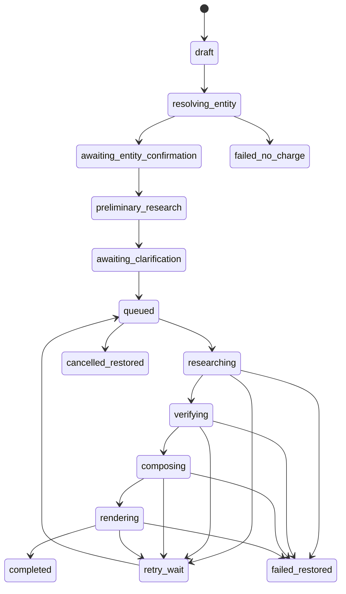

# 09 — Data Model, APIs and Job State

## Principles

Postgres is the source of truth; RLS protects user-owned data; entitlement events are append-only; system Mandate Brief drafts are immutable; evidence is separate from prose; webhooks/jobs are idempotent; stages are checkpointed.

## Core tables

- `users_profile`: role, country, trial status and deletion; never sent to models.
- `entities`: legal name, CIN, type, listed status, office, jurisdiction, status, domain and former names.
- `entity_candidates`: request, candidate payload, confidence, evidence and selection.
- `report_requests`: user, input, confirmed entity, role, optional transaction category, cross-border flag and state.
- `report_jobs`: attempt, queue ID, trace ID, prompts, timestamps, failure, cost and quality result.
- `job_checkpoints`: stage, payload, hash and time.
- `evidence`: source-policy fields, job/entity and retention.
- `claims`: normalised claim, evidence, verifier status and Mandate Brief sections.
- `agent_runs`: agent/model/prompt, tokens, cost, latency, ZDR and error.
- `reports`: request, successful job, system/current version, page count and status. User-facing terminology remains Mandate Brief.
- `report_versions`: parent, creator type, document JSON, rendered files and hash.
- `letterhead_assets`: user/report, storage key, type, scan and expiry.
- `entitlement_ledger`: user, purchase, event, quantity, job, idempotency and expiry.
- `payments` / `refunds`: gateway IDs, amount, currency, package, status and reason.
- `report_issues`: report/version, category, description, resolution and entitlement action.
- `training_consent`: user, consent version/time, withdrawal and scope.

Entitlement events: purchase grant, trial grant, reserve, consume, release, restore, expiry and refund reversal.

## State machine



## Public API outline

- `POST /api/report-requests`
- `POST /api/report-requests/{id}/resolve-entity`
- `GET /api/report-requests/{id}/entity-candidates`
- `POST /api/report-requests/{id}/confirm-entity`
- `GET/POST /api/report-requests/{id}/clarifications`
- `POST /api/report-requests/{id}/generate`
- `GET /api/report-jobs/{id}`
- `GET /api/reports/{id}`
- `POST /api/reports/{id}/versions`
- `POST /api/reports/{id}/letterhead`
- `POST /api/reports/{id}/render`
- `POST /api/reports/{id}/issues`
- `DELETE /api/reports/{id}`
- `POST /api/payments/orders`
- `POST /api/webhooks/razorpay`

## Queue message

```json
{
  "schemaVersion": 1,
  "jobId": "uuid",
  "reportRequestId": "uuid",
  "userId": "uuid",
  "confirmedEntityId": "uuid",
  "attempt": 1,
  "traceId": "trace-id",
  "budgetProfile": "mvp-standard"
}
```

Do not place payment, profile or letterhead data in messages.

## Entitlement transaction

Lock balance, prevent duplicate active generation, append reserve, insert job, enqueue through an outbox and commit atomically.

## Idempotency

Required for payment orders, webhooks, reserve/consume/release, generation, stage completion, PDF render, email and refund.

## Audit question

For any Mandate Brief, admin must identify confirmed entity, answers, sources, models/prompts, cost, quality gates, consumed entitlement, edits and valid training consent.
